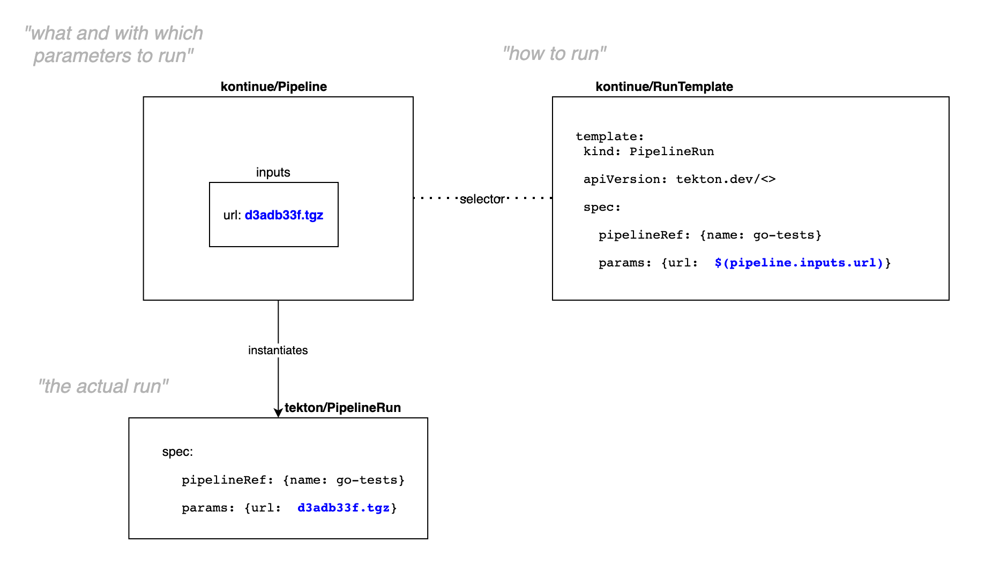
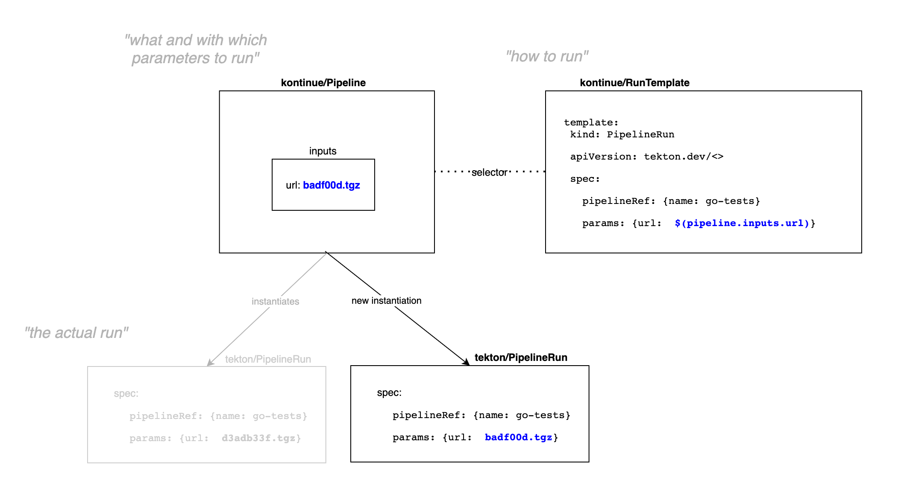

# carto.run/Pipeline in a carto.run/ClusterSupplyChain

**tl;dr:** `git -> pipeline -> img -> deployment` for any git repo indicated by
a workload.

---

In the previous examples, we were making use of `carto.run/Pipeline` as a way
of describing the set of inputs that we'd like some form of pipeline to run
with





which, when having that set of inputs updated, it'd then create a new run for
us.





But, manually updating that spec is not really practical - on every commit,
someone would need to manually patch the spec in order to have a pipeline
executed to test that commit.

Not to mention that for each repository, we'd need to take care of creating new
Pipeline objects, etc etc.

Here is where [cartographer] enters the game.


## Cartographer

Making use of Cartographer, which provides us with the [ClusterSupplyChain]
primitive, we're able to tie different Kubernetes resources together in a way
that the reconciler choreographs passing data from one component to the next,
allowing us to effectively chain these disparate resources together to form a
software supply chain.

For instance, [fluxcd/GitRepository] provides us with the ability of keeping
track of commits that landed in a repository, exposing under `.status.artifact`
that information - exactly what we'd like to plug into our `carto.run/Pipeline`
spec!


```
kind: GitRepository
apiVersion: source.toolkit.fluxcd.io/v1beta1
spec:
  url: <git_url>
status:
  artifact:       
    url: http://source-controller./b871db69.tar.gz ---.
    revision: b871db69 -------------------------------|-----.
                                                      |     |
                                                      |     |
---                                                   |     |
kind: Pipeline                                        |     |
apiVersion: carto.run/v1alpha1                      |     |
spec:                                                 |     |
  inputs:                                             |     |
    source:                                           |     |
      url:       <url_from_gitrepository_obj> <-------'     |
      revision:  <revision_from_gitrepo_obj>  <-------------'

```

Using `carto.run` terminology, that means that we can wrap a `GitRepository` in
a [ClusterSourceTemplate], as it provides source code information, and then
connect that to the `carto.run/Pipeline` making it consume that source
information, and then voilà, we now have the ability of running pipelines
whenever there's a new commit to a git repository.


## The example

Like mentioned before, rather than having the `carto.run/Pipeline` object
carrying a hardcoded `revision` in its `spec.inputs` as in the previous
example, here we make use of [ClusterSupplyChain] to tie together a set
unrelated resources to bring code from source code to a container image in a
registry to a deployment.


```
SUPPLYCHAIN

  
   ...............              ...............              ..............          ..........
   source-provider <----src---- pipeline-runner <----src---- image-provider <--img-- app-runner
   ...............              ...............              ..............          ..........
         .                            .                             .                     .
         .                            .                             .                     .
         .                            .                             .                     .
 fluxcd/GitRepository        carto.run/Pipeline               kpack/Image           Deployment
                                      |
                                      '
                              tektoncd/PipelineRun[1...n]

```


Also, because the `GitRepository` object is actually templated out based on a
`carto.run/Workload` definition, if there's a new repository that we want to
onboard (to make it go through the same software supply chain), all it'd take
is the creation of a new `carto.run/Workload` and then the reconciler would take
care of creating all the objects and doing the whole choreography for us.

In this example, this is demonstrated by the directories [./developer/dev-1]
and [./developer/dev-2].


```

  WORKLOAD-1:   url=gitlab.eng.vmware.com/foo/bar

          source-provider <--src-- pipeline-runner <--src-- image-provider <---img---- app-runner
              |                         |                          |                      |
              '                         '                          '                      '
        find commits for        run pipeline against     build and push container   have a deployment
         foo/bar repo           commits of that repo      image only for those      using the img built
                                                         commmits that passed the   based on foo/bar source
                                                                tests


  WORKLOAD-2:   url=gitlab.eng.vmware.com/something/else

          source-provider <--src-- pipeline-runner <--src-- image-provider <---img---- app-runner
              |                         |                          |                      |
              '                         '                          '                      '
        find commits for        run pipeline against     build and push container   have a deployment
         something/else repo    commits of that repo      image only for those      using the img built
                                                         commmits that passed the   based on something/else
                                                                tests               source

```


[ClusterSourceTemplate]: http://carto.run/docs/reference/#clustersourcetemplate
[ClusterSupplyChain]: http://carto.run/docs/reference/#clustersupplychain
[cartographer]: https://github.com/vmware-tanzu/cartographer
[fluxcd/GitRepository]: https://fluxcd.io/docs/components/source/gitrepositories/

[./developer/dev-1]: ./developer/dev-1
[./developer/dev-2]: ./developer/dev-2
