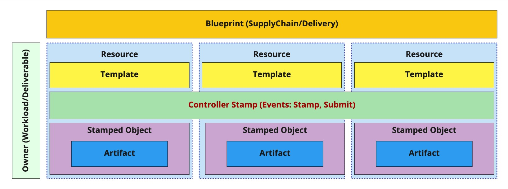
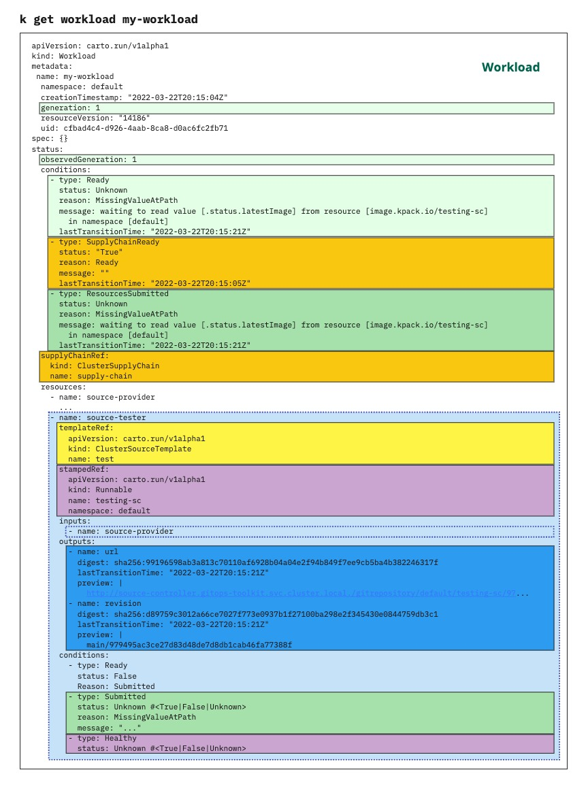
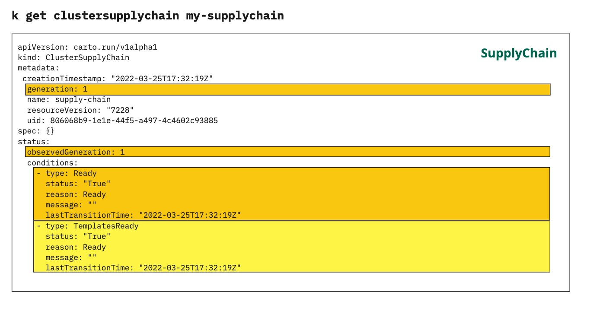

# Meta

[meta]: #meta

- Name: Introduce Kubernetes Events
- Start Date: 2022-03-28
- Author(s): [Rasheed Abdul-Aziz](https://github.com/squeedee)
- Status: Draft <!-- Acceptable values: Draft, Approved, On Hold, Superseded -->
- RFC Pull Request: (leave blank)
- Supersedes: N/A

# Summary

[summary]: #summary

Introduce the use
of [K8s Events](https://github.com/kubernetes/community/blob/master/contributors/devel/sig-architecture/api-conventions.md#events)
to provide user's awareness of state-changing event's that are meaningful for debugging and situational awareness.

# Motivation

[motivation]: #motivation

Developers and Operators need to debug issues where workloads stall, do not make it to deployment, or where other level
changes do not propagate as they should.

Cartographer concern's itself with creating **Stamped Objects** from **Templates** and passing **Artifact**
references between them. By design, the passing of references (and desired state definitions in the **owner** spec)
is _by value_. A user can only see if a state change is transferred from source to sink, not when it happened, or how
often, or even what the specific cause was for a resource to be updated.

This approach lends itself well to the declarative, eventual consistency model of Kubernetes, where "I want this, I
don't care how you get me there" reigns. However, there are times when a user needs to know more detail about the
machinations of the Cartographer controller, especially in debugging failures. For these situations, Kubernetes
provides [events](https://github.com/kubernetes/community/blob/master/contributors/devel/sig-architecture/api-conventions.md#events)
to expose the user to these temporal triggers/actions from inside controller processes.

**Stamping** (creation of the resource definition from template and inputs) and **Submitting** (applying the resource
definition to the cluster) are two very common events, with associated causes, that currently need further exposure to
users.

# What it is

[what-it-is]: #what-it-is

This first diagram shows the objects tracked or managed by the Cartographer controller, except for **Artifact** and
**Controller Stamp**.



## Developer View

To date, Cartographer presents at least some information from all these sources to developers:



Note: `status.resources[.conditions]` do not currently look like this, but there is work to present a **Healthy** status
[in this rfc](https://github.com/vmware-tanzu/cartographer/pull/738). Although there is no art to tackle sharing
per-resource 'Submitted' status (I will raise a separate RFC), it's something that can be handled entirely using the
status in a workload (ie, it does not require the use of events)

With different initiatives (in RFCs for workload status improvements) the developer's view of information is becoming
quite complete, but a key issue is the absence of awareness that "something is happening", especially after they've
committed new code. With event's we can provide information that show's activity and causality not present in the
current snapshot of state.

We add events to the Owners (Workload/Deliverable) to enable debug and reasoning about Cartographer's behavior.

## Operator View

The situation is worse for users managing the supply chains (Devops/Ops). By looking at a supply chain, there is very
little information about how supply chains are behaving, or if any issues are occurring for developers:



Although these users can access the logs, we can provide them a more concise view of how supply chains are behaving
on-cluster.

We add events to the Blueprints (Supply Chain/Delivery) to enable debug and reasoning about Cartographer's behavior.

# How it Works

[how-it-works]: #how-it-works

To avoid over-communicating, and making the view of event's overwhelming and dilute for user's we will start with two
key guiding principles:

1. > Let it be something that isn't satisfactorily presented in other user views (eg: `k get workload`).
2. > Let the event list be as meaningful as is necessary, and no more.

The cartographer controller could emit the following events:

| Reason | Message Format | Description | involvedObject |
| --- | --- | --- | --- |
| ResourceExternalSpecChange | an external actor changed the spec of `<group>.<kind>/<name>` | Our cache of the spec, and the spec we just generated match, but the API server has a different one. A lot of these is evidence of thrashing with external resources | Owner |
| ResourceExternalSpecChange | an external actor changed the spec of resource: `<resource name>` for object `<group>.<kind>` | Our cache of the spec, and the spec we just generated match, but the API server has a different one. A lot of these is evidence of thrashing with external resources | Blueprint |
| ResourceGetError | `<resource name>` could not retrieve `<group>.<kind>/<name>` due to error: `<error message>` | Loading a resource is failing due to a client.get issue (missing is not an error) | Owner |
| ResourceGetError | `<resource name>` could not retrieve `<group>.<kind>` due to error: `<error message>` | Loading a resources is failing due to a client.get issue (missing is not an error) - this could be spammy | Blueprint |
| ResourceGarbageCollected | `<group>.<kind>/<name>` is no longer referenced | This owner has selected a different template, either by supply chain selection or templating, and this object is no longer needed | Owner |
| ImmutableResourceGarbageCollected | `<n> * <group>.<kind>` historical objects deleted due to garbage collection policy | This runnable's GC policy has caused `n` objects to be removed | Runnable |
| ResourceInvalid | `<resource name>` could not be applied as `<group>.<kind>/<name>` due to API server error `<error message>` | This object was (probably) malformed. | Owner |
| ResourceInvalid | `<resource name>` could not be applied as `<group>.<kind>` due to API server error `<error message>` | This object was (probably) malformed. This lets operators know their templates might have issues | Blueprint |
| ResourceDoesNotExist | `<resource name>` could not be applied because `<group>.<kind>/<name>` does not exist on this cluster | Did someone forget to install the CRDs? Otherwise it's a malformed template | Owner |
| ResourceDoesNotExist | `<resource name>` could not be applied because `<group>.<kind>` does not exist on this cluster | Did someone forget to install the CRDs? Otherwise it's a malformed template | Blueprint |
| ResourceApplied | `<resource name>` was applied as `<group>.<kind>/<name>` | a resource needed to be created/updated | Owner |
| ResourceKindChanged | `<resource name>` was `<old group>.<old kind>`, now `<new group>.<new kind>` | YTT selection for a template kind changed | Owner |
| ResourceOutputChanged | `<resource name>` found a new output in `<group>.<kind>/<name>` | a resource produced a new output | Owner |
| ResourceHealthyStatusChanged | `<resource name>` found a new status in `<group>.<kind>/<name>` | a resource produced a new healthy status | Owner |
| SupplyChainChanged | supply chain changed from `<old supply chain name>` to `<new supply chain name>` | Workload selected for a new or different supply chain. Note: `none` is a possible name. | Owner |
| WorkloadSelected | supply chain matched a workload | A workload was selected for. This makes the count a useful metric | Blueprint |

* Cache misses? (Not sure about this, we'll miss if the controller restarts or with HA Elections (future concern))

**Note:** Blueprint event `messages` are usually designed to aggregate on the resource kind, not the individual
resource (we omit `<resource name>`)

There are a lot of event's here, and more could exist, but we should review these during the RFC review process. I hope
we can prune the list and make it `as meaningful as is necessary, and no more`

Example output:

```text
  Type    Reason                      Age                    From                 Message
  ----    ------                      ----                   ----                 -------
Normal    ResourceExternalSpecChange  1m59s (x2 over 1m59s)  workload-controller  an external actor changed the spec of kpack.io.image/java-sample-app
Normal    ResourceExternalSpecChange  35s (x4 over 22s)      workload-controller  an external actor changed the spec of kappctrl.k14s.io/java-sample-app
```

# Migration

[migration]: #migration

THis RFC only adds to the API, there are no breaking changes that require migration.

# Drawbacks

[drawbacks]: #drawbacks

Very little, this is the right thing to be doing.

* Making API calls to emit events will slow processing down, and increase API consumption.
* In code we either end up passing more contextual information to the code-sites that event's originate from, or we
  create a better abstraction than controller-runtimes event recorder to keep value passing to a minimum.

# Alternatives

[alternatives]: #alternatives

- What other designs have been considered?
  - Long tail historic information in the `workload.status` etc. This would be very obnoxious and require some GC over
    time, whereas events are built for this.
- Why is this proposal the best?
  - This is what events are for. It's idiomatic and well supported
- What is the impact of not doing this?
  - Leaving users without temporal event information, making them understand resources intimately, when the side effects
    are all the user really cares about.

# Prior Art

[prior-art]: #prior-art

See k8s native Pods etc.

# Unresolved Questions

[unresolved-questions]: #unresolved-questions

- How many of these events do we really need
- How do we avoid an exhaustive and hard to parse list of events.
