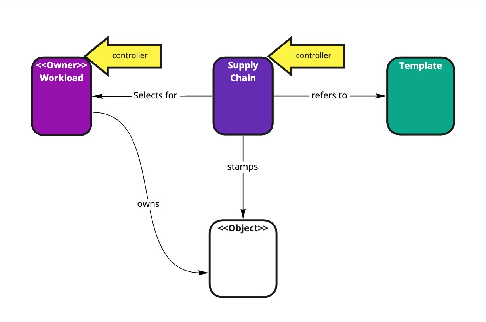
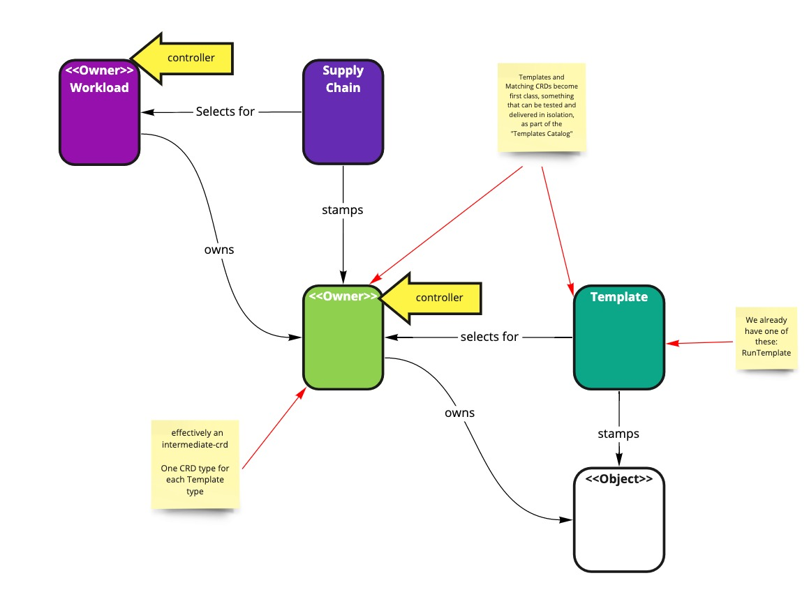

This RFC aims to tackle at once:


# Main goal
Separation of concerns.

When writing a SourceTemplate, the only CRD a Template Author needs to use is a Source CRD

Giving:
1. Isolation from workloads and extensive supply chain definitions
1. Simplifying the creation of a template to reduce the Input Surface area of a components
1. Speed up testing.

# Other things

1. The use of intermediate state crd's for templates
1. Make the RunTemplate and Cluster*Templates closer cousins, as they already appear to be on paper.

# Current Vs Planned
Current:


Planned:


# Workload (unchanged)
```yaml
---
apiVersion: carto.run/v1alpha1
kind: Workload
metadata:
  name: petclinic
  labels:
    supply-chain: "a-good-one"
spec:
  source:
    git:
      url: https://github.com/spring-projects/spring-petclinic.git
```

# Supply Chain
```yaml
---
apiVersion: carto.run/v1alpha1
kind: ClusterSupplyChain
metadata:
  name: responsible-ops---consume-output-of-components
spec:
  selector:
    supply-chain: "a-good-one"
  components:
    - name: source-provider
      template: # or ytt
        apiVersion: carto.run/v1alpha1
        kind: Source
        metadata:
          name: $(workload.name)$
          labels:
            source-provider: "mr-git-fetch"
        spec:
          inputs:
            sources: 
              - $(workload.spec.source)$
    - name: test-provider
      sources:
        - component: source-provider
          name: source
      template: # or ytt
        apiVersion: carto.run/v1alpha1
        kind: Pipeline
        metadata:
          name: $(workload.name)$
          labels:
             source-provider: "run-my-code"
        spec:
          inputs:
            source-url: $(source.url)$
            source-revision: $(source.revision)$
```


# Source-Provider template
```yaml
apiVersion: carto.run/v1alpha1
kind: ClusterSourceTemplate
metadata:
  name: source-template
spec:
  selector:
    source-provider: "mr-git-fetch"
  urlPath: .status.artifact.url
  revisionPath: .status.artifact.revision
  ytt: |
    #@ load("@ytt:data", "data")

    #@ if hasattr(data.values.spec.source, "git"):
    apiVersion: source.toolkit.fluxcd.io/v1beta1
    kind: GitRepository
    metadata:
      name: #@ data.values.metadata.name
      labels:
        app.kubernetes.io/component: source
        #@ if/end hasattr(data.values.metadata, "labels") and hasattr(data.values.metadata.labels, "app.kubernetes.io/part-of"):
        app.kubernetes.io/part-of: #@ data.values.metadata.labels["app.kubernetes.io/part-of"]
    spec:
      interval: 1m
      url: #@ data.values.spec.source.git.url
      ref: #@ data.values.spec.source.git.ref
      gitImplementation: libgit2
      ignore: ""
    #@ end

    #@ if hasattr(data.values.spec.source, "image"):
    apiVersion: source.apps.tanzu.vmware.com/v1alpha1
    kind: ImageRepository
    metadata:
      name: #@ data.values.metadata.name
      labels:
        app.kubernetes.io/component: source
        #@ if/end hasattr(data.values.metadata, "labels") and hasattr(data.values.metadata.labels, "app.kubernetes.io/part-of"):
        app.kubernetes.io/part-of: #@ data.values.metadata.labels["app.kubernetes.io/part-of"]
    spec:
      interval: 1m
      image: #@ data.values.spec.source.image
    #@ end

```


# Normalization of records

The generic form of a template-as-a-transform currently looks like:

```
template = (templateString, [outputPaths, <<conditionFn>>] })
stamp(inputs, template) => <<output>>
```

Issues we would like to address
* `<<output>>` is resolved by outputPaths but the captured values are not persisted  
* `inputs` 
  * are monotypic (except for Pipeline Service) thus forcing generic fields such as,
    Supply Chain: `(params, sources, images)`
    Delivery: `(configs, sources, deployment)`
  * are not persisted.
   
```yaml
    apiVersion: carto.run/v1alpha1
    kind: Source
    metadata:
      name: $(workload.name)$
      labels:
        source-provider: "mr-git-fetch"
    spec:
      inputs: # supported inputs are in a CRD definitition, and their value is easily read with `kubectl get source <name>`
        sources: 
          - git: 
              url: http://....
        images: []
        configs: []
    status:
      conditions:
        ....
      outputs:
        source: # clearly defined output schema
          ....
      # space to record history of this object without cluttering up a workload.
```
