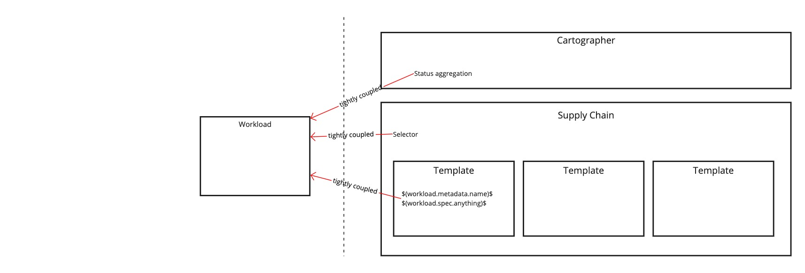
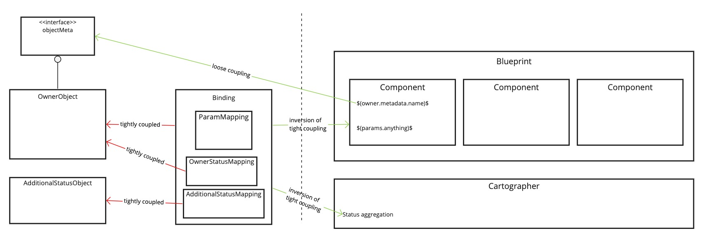

# Meta

[meta]: #meta

- Name: Common Blueprint Architecture
- Start Date: 2022-03-29 (revised: 2022-08-15)
- Author(s): @emmjohnson @martyspiewak @squeedee
- Status: Accepted
- RFC Pull Request: (leave blank)
- Supersedes: N/A

# Summary

[summary]: #summary

This RFC proposes collapsing `ClusterSupplyChain`, `ClusterDelivery` and templates (not including `ClusterRunTemplate`,
as that resource is in the domain of [Runnable](https://cartographer.sh/docs/v0.3.0/reference/runnable/)) into a common
type, `ClusterBlueprint`. As part of this, the RFC proposes that outputs be dynamically typed via a new
CR `ClusterBlueprintType` and remove the statically typed outputs that exist today (url, revision, image, config). This
allows us to maintain the contract of swappable templates, without restricting outputs to a predefined set.
Additionally, the selectors will now be specified in a new CR `ClusterBlueprintBinding`.

# Motivation

[motivation]: #motivation

- Why should we do this?

    - Make the creation and modification of “paths to production” easier by:
        - Supporting consistent design contracts.
        - Supporting self documenting, reusable components.
        - Provide strong tooling (graphical and intelligent editors) that assists authors and validates their designs as
          much as possible, without needing to apply them to a cluster and run the system.
    - In direct support of Tanzu:
        - Build a strong library of components that can be easily repurposed.
        - Deliver top level blueprints that can be easily modified.
    - Allow users to have multiple supply chains installed at the same time, and be able to reason about how selection
      works.

# What it is

[what-it-is]: #what-it-is

## Lifting blueprint dependencies on “Application Platform” domains

We propose replacing the current domain specific CRDs with a set of CRDs that lift and separate the “Platform Authoring”
domain and the “Application Platform” domain.

### Existing tightly-coupled design



### Decoupling proposal



This new approach simultaneously helps with several of our desired goals:

1. By removing the direct access to the owner’s spec, components express all necessary configuration parameters as a
   contract. This offers semantic static evaluation that’s useful in tooling, and allows us to reflect expected
   parameters in the status of a blueprint. *Note*: the templates can access the owner’s metadata, because it’s generic.
2. By decoupling the owner type, components are easily written for reuse across a platform, and possibly across all of
   Cartographer’s user space.
3. Enable platform authors to request operator configuration separate from the blueprint definitions (on the left of the
   dotted line in the diagram). In custom implementations today, kapp’s ytt templates are used to inject configuration
   into parameters inside of supply chains. This makes supply chains much less portable. With the new design,
   the `value` of a parameter can be hardcoded in a Binding, offering a single place to see all the resultant “operator
   configuration”.

# How it Works

[how-it-works]: #how-it-works

The entire design of the API:

- [API Reference for the three CRDs](https://deploy-preview-112--elated-stonebraker-105904.netlify.app/docs/development/reference/blueprints/)
- [An implementation example](https://gist.github.com/squeedee/dc2bf72ff01378b888b500b24c76440a)

Much of the focus in this design is “Strong Contracts”, meaning strict, statically defined types. Dynamic typing
typically requires execution with different test cases to identify issues in contracts. While this works well for TDD
dynamic languages like Ruby and Javascript, it does not fit our goal of providing strong tools for the design and
composition of supply chains.

## Strong parameter contracts

Templates do not have direct access to the Owner Object’s spec in this specification, which means that templates can
only be configured through params. Any parameters used by the template must be specified in the blueprint’s list of
parameters:

```yaml
---
apiVersion: carto.run/v2alpha1
kind: ClusterBlueprint
spec:
  params:
    - name: my-param
      description: this is a parameter exposed by this blueprint
      default: "my-value"   # makes this param optional
    - name: another-param
      description: |
        This does not get used in the template. We won't be able to warn about
        unused params, especially in ytt templates
    - name: strong-typed-with-schema
      description: |
        This param has a strong openApi schema requirement to be an integer
      schema:
        type: integer
    - name: strong-typed-with-cbt
      description: |
        This param must match the schema in the referenced ClusterBlueprintType
      typeRef:
        name: SourceRepository

  template:
    jsonPath:
      spec:
        thing: $(params.my-param)$
        other-thing: $(params.not-legal)$ # this will cause an negative status condition for the ownerObject
```

It is possible for static analysis to observe the illegal use of params in a jsonPath template but not in a ytt
template. Optionally, an author can provide either (but not both)  `params[].schema` and/or `params[].typeRef` field per
parameter, allowing them to define the exact shape of the parameter.

## Clear parameter hierarchies

To ensure clear mapping of parameters from the top level blueprint all the way down to template blueprints, compound
blueprints must specify their parameter list:

```yaml
---
apiVersion: carto.run/v2alpha1
kind: ClusterBlueprint
spec:
  params:
    - name: url
      description: The source git repository blah blah
    - name: branch
      description: The source git repository branch reference
      default: main      # a default override
    - name: destinationImage
      description: name and (optionally) tag of image to build
    - name: scale
      value: 8           # a hard override

  components:
    - name: fetch
      blueprintRef:
        name: git-repository
    - name: build
      inputs:
        - name: source
          valueFrom:
            component: fetch
      blueprintRef:
        name: kpack-build
      paramRenames:
        - from: destinationImage
          to: image
```

The behavior of params provided in compound blueprints:

- By default, all params are passed with the same name to all components, thus components can share a parameter.
- Params must be defined to be accessible within the component.
- Params with a `value` are not exposed to a consumer of this blueprint. This allows component authors to use
  sub-components while setting specific values they do not want exposed to Platform Operators or Consumers (developers)
- Params with a `default` provide a default value, making the parameter optional. Setting a default here overrides any
  defaults in child components
- Eliding the `description` will provide an empty description. Cartographer will not promote param descriptions in child
  components.

There are occasions when a component author’s choice of parameter name does not match the contract you want to expose in
your compound blueprint. In the above example, the author of kpack-build exposes an `image` parameter, where the built
image is created. The author of this compound blueprint wants to expose the same parameter as `destinationImage` for
clearer documentation (or to avoid collisions with other components), so they use `paramRenames` to achieve this.

`paramRenames` also supports scenarios where two identically named parameters resolve to different schemas. The params
list can be checked by an IDE plugin or graphical tool for correctness, with static errors for unfulfilled parameters
from components.

## Strong input and output contracts

Inputs and outputs to any blueprint also follow the same design goal of being well defined. Here we go further and
provide shared “types” to help Platform Authors establish a *common language* for components in the system:

```yaml
---
apiVersion: carto.run/v2alpha1
kind: ClusterBlueprintType
metadata:
  name: tanzu.source
spec:
  description: |
    Represents a SCM tool url. Revision should point to a specific revision,
    not a mutable tag.
  qualifier: tanzu
  schema:
    type: object
    properties:
      url:
        type: string
        description: |
          git url for the repository containing 
          a constrained version of code
      revision:
        type: string
        description: |
          a ref, usually a SHA, that points to a constrained 
          (immutable) reference in the repository
      required:
        - url
        - revision

```

The ClusterBlueprint type specifies the shape of an output (and subsequent inputs) for a blueprint. It uses the
OpenAPIv3 JSONSchema to do this as it’s well recognized and used in CRDs on k8s. It has name collision avoidance by way
of `spec.qualifier`, where the name must include the qualifier. A Platform Author commits to publishing types with a
standard qualifier (`tanzu` in this case) so that Platform operators can create their own types without worrying about
name collisions.

Contracts are enforced with a set of fields in a blueprint.

### First, a template blueprint:

```yaml
---
apiVersion: carto.run/v2alpha1
kind: ClusterBlueprint
metadata:
  name: snyk-scan
spec:
  outputTypeRef:
    name: tanzu.image

  inputs:
    - name: image
      description: the image to be scanned
      typeRef:
        name: tanzu.image

  params:
    - name: caCertificate
      description: provides a TLS trustable cert
      default: ""

  template:
    jsonPath:
      kind: ImageScan
      spec:
        image: $(inputs.image)$
        cert: $(params.caCertificate)$
    outputMapping:
      - path: .
        resourcePath: .status.compliantArtifact.latestImage

```

The type that a blueprint emits *must* be specified with `spec.outputTypeRef`. This is simply a reference to a
ClusterBlueprintType. To fulfill this requirement, the template author specifies a `spec.outputMapping`. Outputs can be
constructed using multiple paths, and by passing whole values (simple or complex):

```yaml
    outputMapping:
      - path: .url
        resourcePath: .status.artifact.url
      - path: .revision
        resourcePath: .status.artifact.reference
```

Outputs only need to be fulfilled so they are valid. For example, the following type is satisfied with a string value.

```yaml
---
apiVersion: carto.run/v2alpha1
kind: ClusterBlueprintType
metadata:
  name: tanzu.source
  qualifier: tanzu
  schema:
    oneOf:
      - $ref: '#/schemas/git'
      - $ref: '#/schemas/image'

  schemas:
    git:
      type: object
      properties:
        url:
          type: string
        revision:
          type: string
        required:
          - url
          - revision
    image:
      type: string

```

The inputs consumed by the template *must* be specified in the `spec.inputs` field. Each input has a name for use both
in the template and in compound blueprints that consume this template. Each input also has a ref to the
ClusterBlueprintType it must conform to. To consume the input in a template, the author simply
interpolates `inputs.<input-name>` in the template. They can of course reference fields in a complex type,
e.g.: `$(inputs.source.url)$`

### A compound blueprint:

```yaml
---
apiVersion: carto.run/v2alpha1
kind: ClusterBlueprint
metadata:
  name: scan-and-relocate
spec:
  outputTypeRef:
    name: tanzu.image

  inputs:
    - name: image
      typeRef:
        name: tanzu.image

  params:
    - name: image
      description: destination for image
    - name: caCertificate
      description: provides a TLS trustable cert
      default: ""

  components:
    - name: scan
      blueprintRef:
        name: snyk-scan
      inputs:
        - name: image
          valueFrom:
            input: image
    - name: relocate
      inputs:
        - name: image
          valueFrom:
            component: scan
      blueprintRef:
        name: crane-relocate

```

Blueprints that consume an input type, must do so “completely”. That is, if the input type is a oneOf type, then both
possible schema shapes must be supported. With the example above, where the `tanzu.source` ClusterBlueprintType requires
either a string or a “url/revision” tuple, a blueprint using that input must support both forms.

Compound blueprints differ from template blueprints in how components receive inputs from parent blueprints and other
components. The `spec.typeRef` and `spec.inputs` fields behave in the same way as a template blueprint.

To consume an external input (one defined in `spec.inputs`) the author specifies `components[].inputs` like this:

```yaml
      inputs:
        - name: image
          valueFrom:
            input: image
```

The important field here is `input`, which specifies that the input to the child component comes from an input to this
blueprint.

Conversely, to take an input from the output of another component:

```yaml
      inputs:
        - name: image
          valueFrom:
            component: scan
```

The author specifies `component`, which is the name of the component that emits an output that *must* match this input.
With these contracts, tooling can easily verify blueprints, so long as the dependent components (those mentioned in
`blueprintRefs`) are available to analyze.

## Bring your own “owner/origin/trigger” object

Workload and Deliverable are domain specific (to Application Platforms) and so limit Platform Authors in the shape and
intent of their “triggering” owner objects.

Instead, the blueprint spec supports any resource as an owner object, by way of the ClusterBinding.

```yaml
---
apiVersion: carto.run/v2alpha1
kind: ClusterBinding
spec:
  ownerSelector:
    apiVersion: my.org/v1
    kind: Builder
    matchLabels:
      ou: finance
  blueprintRef:
    name: build-and-relocate
  params:
    - name: url
      path: spec.source.url
    - name: branch
      path: spec.source.branch
      default: "main"
    - name: caCertificate
      path: spec.certificate
    - name: destinationImage
      path: spec.destination.image
    - name: developmentImage
      path: spec.dev.imageRepo
      value: dev.registry.my.org # see “configuration in one place” later in the document.
  statusMapping:
    jsonPath:
      conditions: $(status.conditions)$ 
```

The `spec.blueprintRef` field specifies the blueprint to select, and the `spec.ownerSelector` specifies criteria to
select how an owner object is selected. The `apiVersion` and `kind` of the `ownerSelector` are used to establish
Cartographer’s informers, watching all objects of that kind to see if they match a binding, and subsequently, a
blueprint.

ClusterBindings can compete for a resource (as they do with the current Cartographer design) so two rules of specificity
are applied:

1. The most specific (most matchers) selector wins
2. If there are more than one “most specific” matches, it is an error.

By specifying `spec.params` and `spec.statusMapping`, the ClusterBinding defines the shape of a Platform Author’s owner
object without the need to modify blueprints.

The `params` field defines how to fulfill the Blueprints params from the shape of the owner object, while the
`statusMapping` defines the shape of the status in the owner object.

The `statusMapping` allows Platform Operators to use ytt to elide specific content, as there is risk of sensitive
information existing in the complete status object.

By referencing a version of the owner object through `apiVersion`, Application Operators and Platform Authors can change
their owner object CRD over time, without the need to immediately update all their ClusterBindings. Conversely, new
components can be released without forcing changes to the CRD.

## Configuration in one place

ClusterBinding provides a single location for Application Operator’s configuration values.

```yaml
---
apiVersion: carto.run/v2alpha1
kind: ClusterBinding
spec:
  params:
    - name: url
      path: spec.source.url
    - name: branch
      path: spec.source.branch
      default: "main"
    - name: caCertificate
      path: spec.certificate
    - name: destinationImage
      path: spec.destination.image
    - name: developmentImage
      path: spec.dev.imageRepo
      value: dev.registry.my.org 
```

When deploying ClusterBindings, filling certain `spec.params[].values` provides a clean mechanism for setting
configuration of the blueprints. Compare with the current system of modifying the Supply Chains as they are applied.

# Migration

[migration]: #migration

We will write tooling to help existing traditional Supply Chains move to the new Blueprints design.

# Drawbacks

[drawbacks]: #drawbacks

Why should we *not* do this?

# Alternatives

[alternatives]: #alternatives

- What other designs have been considered?
    - Typed blueprints (`ClusterSourceBlueprint`, `ClusterImageBlueprint`, etc.)

- Why is this proposal the best?
    - It allows users to define the blueprint types and the outputs they care about.

- What is the impact of not doing this?
    - We will not be able to reconcile templates easily.
    - Users will continue to struggle with the learning curve.

# Prior Art

[prior-art]: #prior-art

[knative duck types](https://pkg.go.dev/knative.dev/pkg/apis/duck#:~:text=Knative%20leverages%20duck%2Dtyping%20to,Addressable%20%2C%20Binding%20%2C%20and%20Source%20.)

# Unresolved Questions

[unresolved-questions]: #unresolved-questions

N/A

# Spec. Changes (OPTIONAL)

[spec-changes]: #spec-changes

This RFC proposes all new CRDs.
