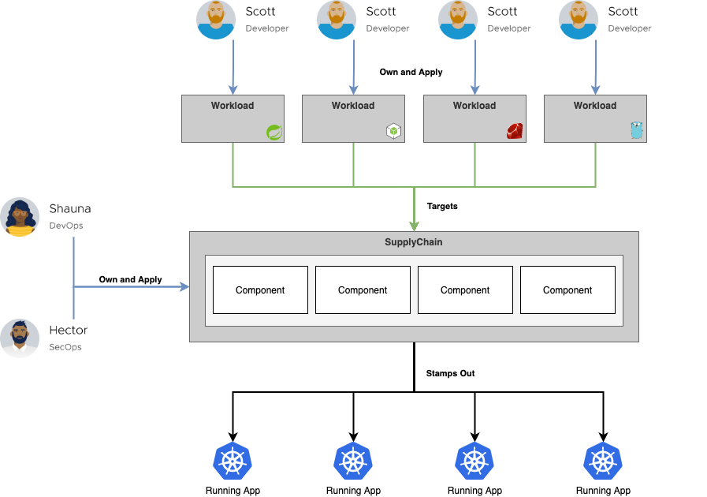

## TLDR

Cartographer is a Kubernetes native Supply Chain Choreographer. It allows App Operators to create pre-approved paths to production by integrating k8s resources with the elements of their existing toolchains (e.g. Jenkins).

Each pre-approved supply chain creates a paved road to production; orchestrating supply chain components - test, build, scan, and deploy - allowing developers to be able to focus on delivering value to their users while also providing App Operators with the peace of mind that all code in production has passed through all of the steps of an approved workflow.

## Cartographer Design and Philosophy

Cartographer is a Kubernetes (K8s) native supply chain choreographer. In other words, Cartographer allows users to define all of the steps that an application must go through before reaching a production environment. Users can codify their paths to production using two abstractions:

* Supply Chain ([Spec Reference](reference.md/#clustersupplychain))
<!-- * Deliverable ([Spec Reference](reference.md)) -->

The supply chain allows users to define the steps that an application must pass through in order to create an image. The deliverable portion of a Cartographer workflow allows the user to define the steps that the built image must pass through. By combining supply chains with delivery, the entire path to production can be specified and thereby choreographed by Cartographer.

The supply chain and delivery are not bound to a single cluster. Cartographer embraces a gitOps approach for image promotion across clusters - a gitOps repo is used to track the Kubernetes configuration that corresponds to a given application. The delivery portion will watch that same gitOps repository and initiate the second half of the path to prod whenever a new configuration is pushed to the repository.

Both the supply chain and delivery consist of components that are specified via Templates. Each template acts as a wrapper for existing Kubernetes resources and allows them to be used with Cartographer. There are currently four different types of templates that can be use in a Cartographer supply chain or deliverable:

* Source Template ([Spec Reference](reference.md/#clustersourcetemplate))
* Image Template ([Spec Reference](reference.md/#clusterimagetemplate))
* Opinion Template ([Spec Reference](reference.md/#clusterconfigtemplate))
* Cluster Config Template ([Spec Reference](reference.md/#clustertemplate))

 Contrary to many other Kubernetes native workflow tools that already exist in the market, Cartographer does not “run” any of the objects themselves. Instead, it monitors the execution of each component and templates the following component in the supply chain or delivery after a given component has completed execution and updated its status.

The supply chain and delivery may also be extended to include integrations to existing CI and CD pipelines by using the Pipeline Service (which is part of Cartographer Core). The Pipeline Service acts as a wrapper for existing CI and CD tooling (with support for Tekton and Jenkins, and with supporting more providers in the future) and provides a declarative way for pipelines to be run inside of Cartographer.

While the supply chain and delivery are both operator facing, Cartographer also provides an abstraction for developers called workloads ([Spec Reference](reference.md/#workload)). Workloads allow developers to specify application specifications such as the location of their repository, environment variables and service claims.

By design, supply chains can be reused by many workloads. This allows an operator to specify the steps in the path to production a single time, and for developers to specify their applications independently but for each to use the same path to production. The intent is that developers are able to focus on providing value for their users and can reach production quickly and easily, while providing peace of mind for app operators, who are ensured that each application has passed through the steps of the path to production that they’ve defined.

